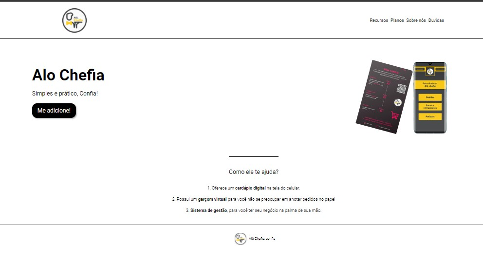

# Alô Chefia

## Landing page para um aplicativo.

o Alô Chefia é um garçom virtual com cardápio digital

<h4 align="center"> 
	🚧 🚀 Em construção...  🚧
  </h4>

<h1 align="center">
  
</h1>

 <a href="#objetivo">Objetivo</a> • 
 <a href="#tecnologias">Tecnologias</a> •  
 <a href="#autor">Autor</a>

  
  ## Objetivo 
  
  #### Testar meu HTML e CSS Puro.
  
  ## Tecnologias
  
  #### HTML e CSS
  
  ## Autor
  
  #### Jonas Benjamim
  
